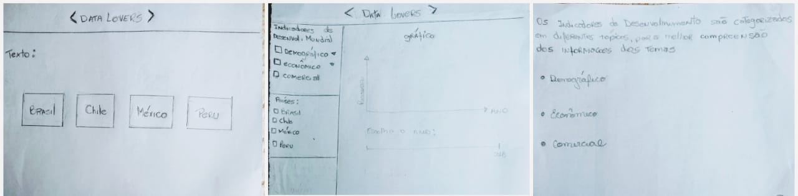
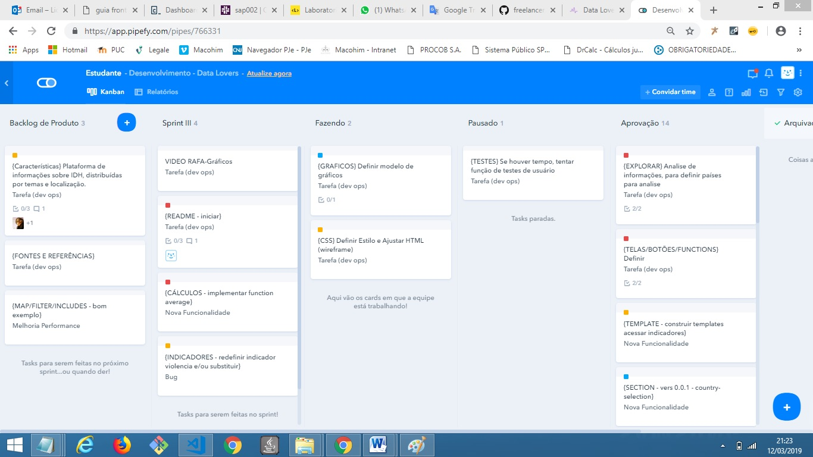
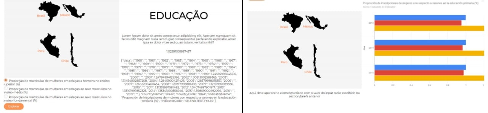
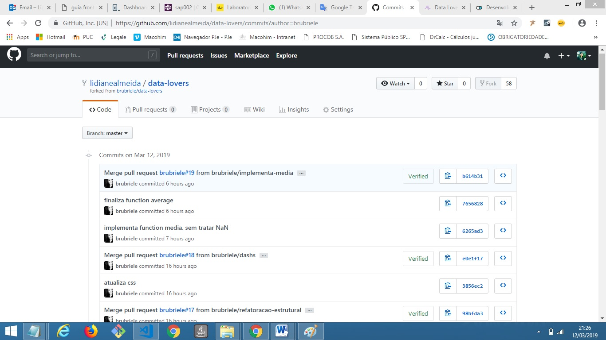

# PROJETO: DataLovers

O cliente necessita de um site para visualizar dados sobre Indicadores de desenvolvimento do Banco Mundial entre os anos de 2013 á 2015 de alguns países (Brasil, Chile, México e Peru).
O objetivo da plataforma é expor dados sobre o IDH preferencialmente na área da educação, visualizando dados de 3 indicadores agrupados por ano e país.

***

## Personas:

* Roberto -  27 anos
* Profissão: Professor Ciências Sociais
* Mídias: Livros acadêmicos, revistas, site de jornalismo de dados, portais do MEC.
* Objetivos: Planejamento de aulas, apresentar assuntos da grade curricular (violência urbana, taxa de suicídio, desigualdade social, trabalho, etc) a partir de informações disponíveis em bancos de dados públicos, explorando indicadores de desenvolvimento humano e métricas estatísticas em sala de aula.
* Desafios: Precisa de sites que apresentem as informações de forma clara e sintética para melhor compreensão e acesso dos alunos.
***
* Joana - 38 anos
* Profissão: Pesquisadora – Área Proteção Social
* Mídias: Lê artigos, revistas acadêmicas, bancos de dados públicos (ex: CRAS, CEBRAP,PNUD).
* Objetivos: Correlacionar informações locais com levantamentos de IDH, isto é, dados macro, para comparados a dados micro-regionais de desenvolvimento.
* Desafios: Não consegue acessar as informações de indicadores numéricos e
categóricos, distribuídos por temas de forma gráfica/visual.

Obs. perfil criado através do site https://geradordepersonas.com.br/

***

## Extra

Abaixo rascunho de 03 telas, por onde foi possível criar uma base para o desenvolvimento do site. Informações deverá ser exibida em gráficos de barras, para melhor compreensão dos dados.

***

### Desenho da interface de usuário - Protótipo
Apartir dos esboços da solução feita com papel
e lápis, realizado iterações através de desenhos de protótipos de média fidelidade usando o [Canvas](https://www.canva.com/pt_br/).

***

## Organização e Planejamento

Empregamos cronogramas através de app para administrar tarefas e organizar etapas do projeto.

***

## Design do projeto em andamento

***

## Teste de usabilidade

Conforme teste em browsers variados, constatado que o metodo "event.preventDefault" não está sendo executado no MOZZILA FIREFOX.

Na versão atual apresentada, consta as seguinte partes em contrução: usuário filtrar e ordenar os dados, botão tema violência, e alguns ajustes de página para melhor visualização do usuário.

***

Utilizado repositórios de testes no GitHub para subir novas versões de dados. O objetivo é evitar conflito de versões e otimizar o tempo no mesmo tópico do projeto.

Segue link para visualização da última versão do projeto https://brubriele.github.io/data-lovers/

***

# CRITÉRIOS DO PROJETO

## Checklist - Implementação de Interface de Usuário (HTML/CSS/JS)

Logo após desenhar sua interface de usuário você deverá trabalhar em sua
implementação. Como mencionamos, **não** é necessário que desenvolva uma
interface tal como a desenhou. Você terá um tempo limitado para codar, então,
deverá priorizar. Como mínimo, sua implementação deve:

1. Mostrar os dados em uma interface: pode ser um card, uma tabela, uma
   lista, etc.
2. Permitir ao usuário filtrar e ordenar os dados.
3. Calcular estatísticas como média aritmética, máximo e/ou mínimo de algum
   atributo numérico, ou contar quantas vezes aparece um determinado valor,
   por exemplo.

***

### Desenvolvimento Front-end

* Unidade de arrays no curso de JavaScript no LMS.
* Unidade de objetos no curso de JavaScript no LMS.
* Unidade de funções no curso de JavaScript no LMS.
* Unidade de DOM no curso de Browser JavaScript no LMS.
* [Array no MDN](https://developer.mozilla.org/pt-br/docs/Web/JavaScript/Referencia/Objetos_globales/Array)
* [Array.sort no MDN](https://developer.mozilla.org/pt-br/docs/Web/JavaScript/Referencia/Objetos_globales/Array/sort)
* [Array.map no MDN](https://developer.mozilla.org/pt-br/docs/Web/JavaScript/Referencia/Objetos_globales/Array/map)
* [Array.filter no MDN](https://developer.mozilla.org/pt-br/docs/Web/JavaScript/Referencia/Objetos_globales/Array/filter)
* [Array.reduce no MDN](https://developer.mozilla.org/pt-br/docs/Web/JavaScript/Referencia/Objetos_globales/Array/reduce)
* [Array.forEach no MDN](https://developer.mozilla.org/pt-br/docs/Web/JavaScript/Referencia/Objetos_globales/Array/forEach)
* [Object.keys no MDN](https://developer.mozilla.org/pt-br/docs/Web/JavaScript/Referencia/Objetos_globales/Object/keys)
* [Object.entries no MDN](https://developer.mozilla.org/pt-br/docs/Web/JavaScript/Referencia/Objetos_globales/Object/entries)
* [Fetch API no MDN](https://developer.mozilla.org/pt-br/docs/Web/API/Fetch_API)
* [json.org](https://json.org/json-pt.html)